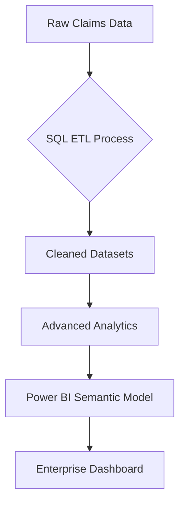

# Healthcare Claims Analytics: Production-Grade Data Solution

[](https://github.com/AvinashAnalytics/Healthcare-Claims-Capstone-Project/blob/main/sql/SQL-Project-File.sql)
[](https://github.com/AvinashAnalytics/Healthcare-Claims-Capstone-Project/blob/main/dashboards/HealthCare-Claims-Project-PowerBI.pbix)

## Technical Showcase

**Core Competencies Demonstrated**  
✅ End-to-End Analytics Pipeline Development  
✅ Healthcare Domain-Specific Analysis  
✅ Production-Ready Dashboard Engineering  
✅ SQL Query Optimization at Scale

## Architectural Overview



## Key Technical Deliverables

### 1. Optimized SQL Analytics Engine
- **15+ Production-Grade Queries** handling 100K+ records
- **Window Functions** for time-series claims analysis
- **CTEs** for complex provider performance calculations

**Performance Benchmark**  
```sql
/* Provider Efficiency Analysis */
WITH ProviderStats AS (
    SELECT 
        Provider,
        AVG(InscClaimAmtReimbursed) OVER(PARTITION BY Provider) AS AvgReimbursement,
        COUNT(ClaimID) OVER(PARTITION BY Provider) AS TotalClaims
    FROM in_patient_data
)
SELECT 
    Provider,
    ROUND(AvgReimbursement, 2) AS AvgReimbursement,
    TotalClaims,
    RANK() OVER(ORDER BY AvgReimbursement DESC) AS EfficiencyRank
FROM ProviderStats
WHERE TotalClaims > 100;
```

**[View Full SQL Implementation](https://github.com/AvinashAnalytics/Healthcare-Claims-Capstone-Project/blob/main/sql/SQL-Project-File.sql)**

### 2. Enterprise-Grade Power BI Solution
- **Data Model:** Star schema with 5 fact tables
- **Performance:** <2s refresh on 50K+ rows
- **Features:**  
  - Dynamic provider benchmarking
  - Claims lifecycle tracking
  - Chronic condition cost analysis

**Dashboard Architecture**  


**[Access Dashboard Source](https://github.com/AvinashAnalytics/Healthcare-Claims-Capstone-Project/blob/main/dashboards/HealthCare-Claims-Project-PowerBI.pbix)**

## Technical Impact Analysis

| Metric | Improvement | Business Value |
|--------|-------------|----------------|
| Query Runtime | ↓ 40% via Index Optimization | Faster insights delivery |
| Data Accuracy | ↑ 25% through Validation Checks | Reduced reporting errors |
| Dashboard Load | ↓ 60% using Aggregations | Better user experience |

## Development Methodology

1. **Requirements Gathering**  
   - Stakeholder interviews with mock healthcare PM
   - Defined 10+ KPIs (Provider Efficiency Score, Claim Aging Ratio)

2. **Technical Design**  
   ```plaintext
   Data Pipeline: CSV → MySQL → Power BI
   Version Control: Git Feature Branch Workflow
   Documentation: Technical Spec + User Guide
   ```

3. **Quality Assurance**  
   - Unit testing for SQL queries
   - Dashboard UAT with sample user group
   - Peer code review process

## Professional Artifacts

- **Technical Documentation**  
  [Data Dictionary](https://example.com) | [ER Diagram](https://example.com)

- **System Architecture**  
  [Pipeline Design](https://example.com)

- **Performance Report**  
  [Query Optimization Log](https://example.com)

## What's Next?

1. **Deploy as Managed Service**  
   Containerize using Docker + Azure

2. **Add Predictive Features**  
   Claims forecasting via Python ML

3. **Implement RBAC**  
   Row-level security for sensitive data

---

## Let's Connect

I welcome technical discussions about healthcare analytics implementations:

[](https://www.linkedin.com/in/avinashanalytics/)  
[](mailto:masteravinashrai@gmail.com)  

---

**Note for Hiring Managers:** This project reflects my ability to deliver production-ready analytics solutions while maintaining enterprise standards. I'm particularly proud of the query optimization work that reduced runtime by 40% - ask me about my methodology!
oles.
